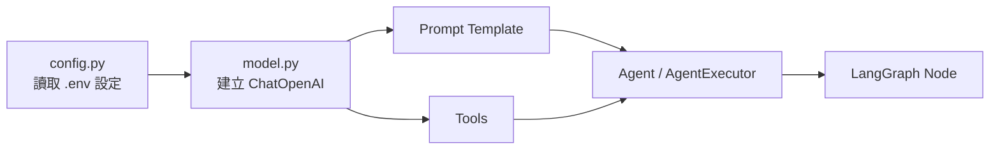
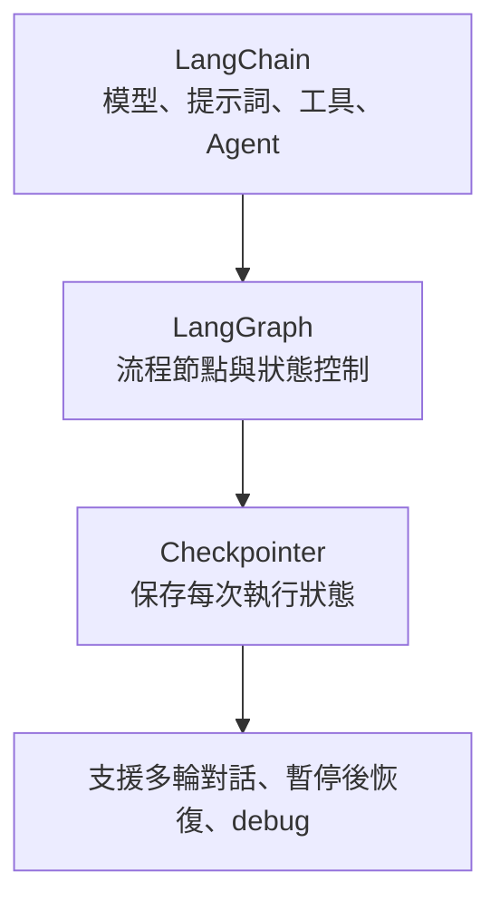

# 第一項：LangChain 初始化語言模型

這一階段只處理 LangChain 四個工作中的第一項：

> a. 初始化語言模型（Large Language Model）

目前程式放在：

- `src/LangChain/config.py`
- `src/LangChain/model.py`
- `examples/01_init_llm.py`

## 1. 這段程式在整個系統中的角色

LangChain 會負責把「模型、提示詞、工具、Agent」接起來。初始化語言模型是最底層的第一步，後面三項都會依賴它：



所以這一層的設計重點不是「馬上回答很多問題」，而是讓後面的 Prompt、Tools、Agent、LangGraph 都能共用同一個模型建立方式。

## 2. 目前採用的設計

`config.py` 負責讀取環境變數：

- `OPENAI_API_KEY`
- `OPENAI_CHAT_MODEL`
- `OPENAI_TEMPERATURE`
- `OPENAI_TIMEOUT_SECONDS`
- `OPENAI_MAX_RETRIES`

`model.py` 負責建立 LangChain 的 Chat Model：

```python
from LangChain.model import build_chat_model

llm = build_chat_model()
response = llm.invoke("請用一句話介紹 LangChain")
print(response.content)
```

隊友之後不需要直接碰 `ChatOpenAI(...)`，只要呼叫 `build_chat_model()`。

## 3. 為什麼要把設定和模型初始化分開？

這樣做有三個好處：

1. API Key 不會寫死在程式碼裡。
2. 之後要換模型時，只要改 `.env` 或 `config.py`。
3. LangGraph、Agent、FastAPI 都可以共用同一個模型初始化入口。

也就是說，這一層像是整個 AI 系統的「模型插座」：後面的模組只管插上來，不需要知道電線怎麼接。

## 4. 和隊友的串接方式

其他組員如果需要模型，請這樣使用：

```python
from LangChain.model import build_chat_model

llm = build_chat_model()
```

不要在各自的檔案裡重複寫：

```python
from langchain_openai import ChatOpenAI

llm = ChatOpenAI(...)
```

因為這會讓模型名稱、temperature、retry、timeout 分散在不同地方，後期會很難維護。

## 5. LangChain 和 LangGraph 的差別

簡單說：

- LangChain：負責「單一能力元件」的組裝，例如模型、提示詞、工具、Agent。
- LangGraph：負責「流程狀態」的控制，例如 retrieve → rerank → generate → decide 是否結束。

可以把它們想成：

| 項目 | LangChain | LangGraph |
| --- | --- | --- |
| 核心問題 | 我要怎麼使用模型、Prompt、Tool、Agent？ | 這些步驟要照什麼流程跑？ |
| 適合處理 | LLM 呼叫、Prompt Template、Tools、Agent | 多節點流程、條件分支、循環、狀態管理 |
| 在本專案角色 | 建立可被呼叫的 AI 能力 | 把 AI 能力放進檢索系統流程 |
| 記憶方式 | 可搭配訊息或外部記憶 | 透過 Checkpointer 保存 graph state |

因此你小組中的分工可以這樣理解：



## 6. Checkpointer 是什麼？

Checkpointer 是 LangGraph 裡用來保存流程狀態的機制。

如果沒有 Checkpointer，每一次呼叫 graph 都像是重新開始；如果有 Checkpointer，LangGraph 可以根據 `thread_id` 記住某個使用者或某段對話的狀態。

之後你在 LangGraph 大概會長得像這樣：

```python
from langgraph.checkpoint.memory import MemorySaver

checkpointer = MemorySaver()
graph = builder.compile(checkpointer=checkpointer)
```

正式部署時，`MemorySaver` 通常只適合開發測試；如果要多人使用或服務重啟後仍保留狀態，會再改成資料庫型的 checkpointer。

## 7. 本階段可以展示的成果

執行：

```powershell
.venv\Scripts\python.exe examples\01_init_llm.py
```

如果 `.env` 設定正確，應該會看到模型用繁體中文回覆一句 LangChain 的用途。
