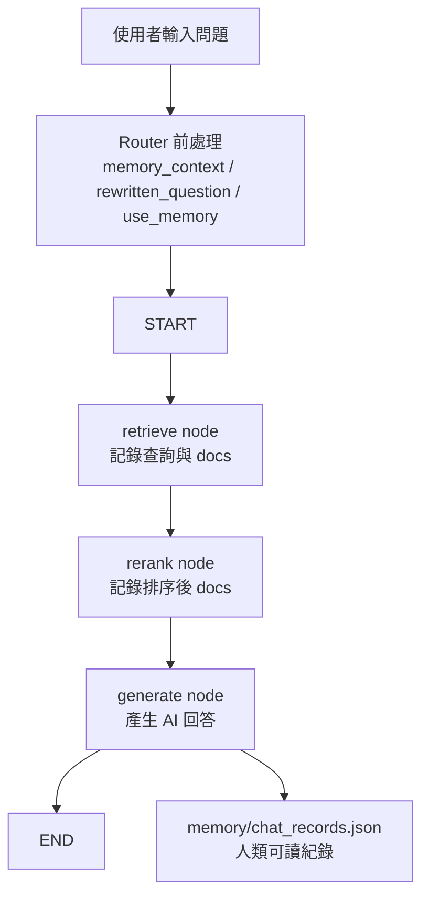

# 正式 LangGraph 設計

目前 Graph 採用「router 在 graph 外、三個主要節點在 graph 內」的設計。

## 1. 為什麼 router 不放進 graph？

因為目前設計中，router 是前處理：

```text
讀取短期記憶
判斷 use_memory
產生 rewritten_question
決定 route
```

它負責讓後面的 graph 知道要查什麼、要不要使用記憶。

真正的 LangGraph 主流程保留剪報中的三個節點：

```text
retrieve → rerank → generate
```

## 2. 目前流程圖



## 3. 程式位置

正式 LangGraph 放在：

```text
src/LangGraph/graph.py
```

共用流程入口放在：

```text
src/LangGraph/flow.py
```

CLI 與 FastAPI 都會呼叫：

```python
run_chat_flow(...)
```

## 4. Checkpointer

目前專案先不使用記憶體版 checkpointer。

現在的版本是：

```python
graph = build_graph().compile()
```

也就是說，目前已經有真正的 LangGraph 節點流程：

```text
START → retrieve → rerank → generate → END
```

但還沒有接 LangGraph 內建的 Checkpointer。

目前 `memory/chat_records.json` 負責保存人類可讀的對話與節點紀錄；它不是 LangGraph Checkpointer，而是我們自己設計的簡化記憶紀錄。

之後如果真的需要 Checkpointer，會另外討論 SQLite、資料庫，或自訂儲存方式。

## 5. 和 hsu 檢索模組的關係

目前 `retrieve_node` 和 `rerank_node` 還是佔位節點。

之後整合 hsu 時：

```text
retrieve node：呼叫 hsu API 或函式取得 docs
rerank node：接收排序後 docs
generate node：使用 docs/context 生成回答
```

所以可以先完成 Graph，不必等資料庫或 Qdrant 完全接好。
